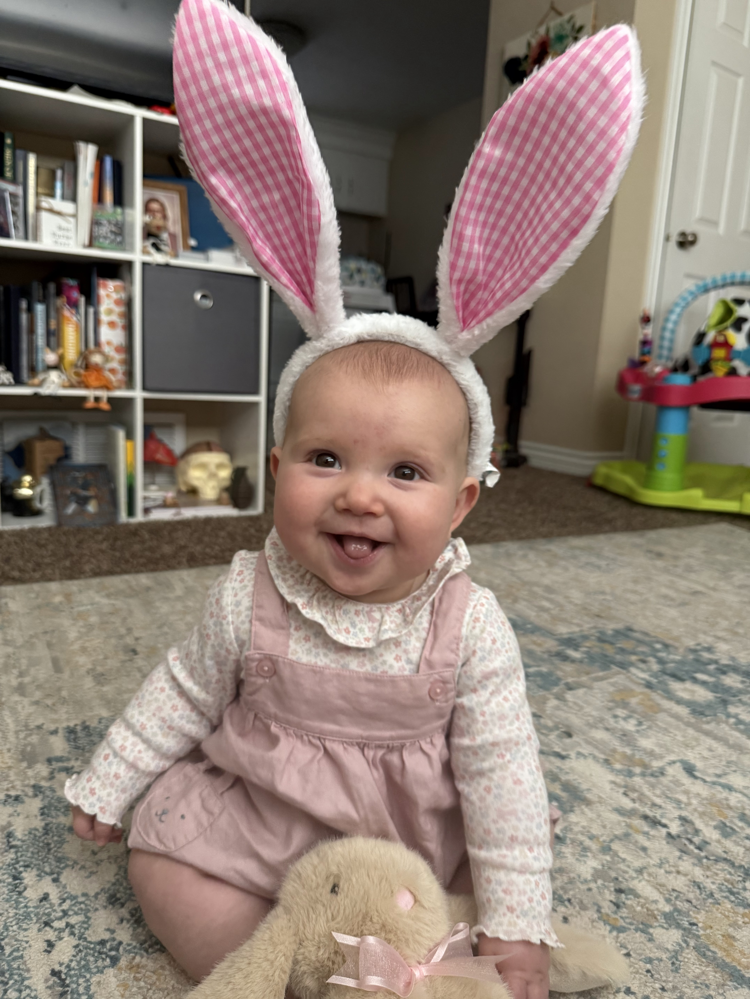
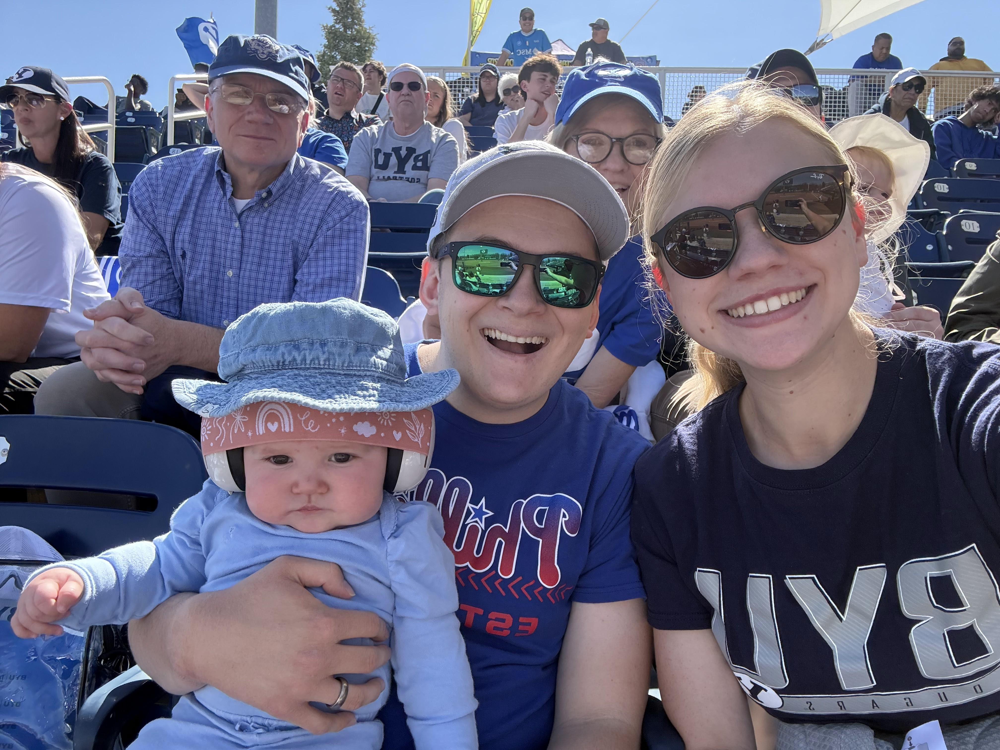
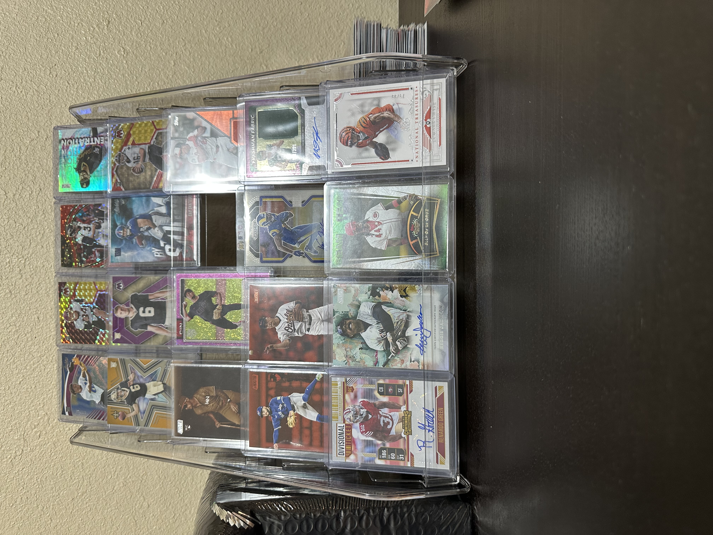
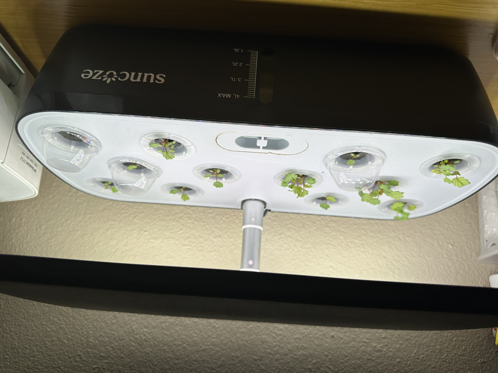
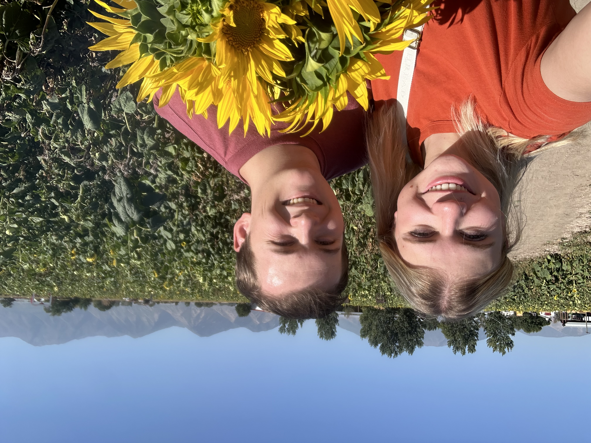

```{r setup, include=FALSE}
knitr::opts_chunk$set(echo = TRUE)
```
[Return to Homepage](../index.html)

# **About Me (Kai)**
I am a microbiology major, and after graduation I plan on attending medical school specializing in infectious disease or pathology.Me and why wife just had a baby in October 2025 and she is wonderful and loves anything that crinkles. Some of my hobbies include walks with my family, selling baseball and football cards, and anything outside. I also enjoy gardening. A random fact about me is that I speak Finnish.  


## Photos 
The baby.

```{r, echo = FALSE, out.width = "100%"}

```


The family at a softball game.

```{r, echo = FALSE, out.width = "100%"}

```


One of my hobbies.

```{r, echo = FALSE, out.width = "100%"}

```


Strawberries that I am growing inside

```{r, echo = FALSE, out.width = "100%"}

```

Me and my wife at cornbellies 
```{r, echo = FALSE, out.width = "100%"}

```